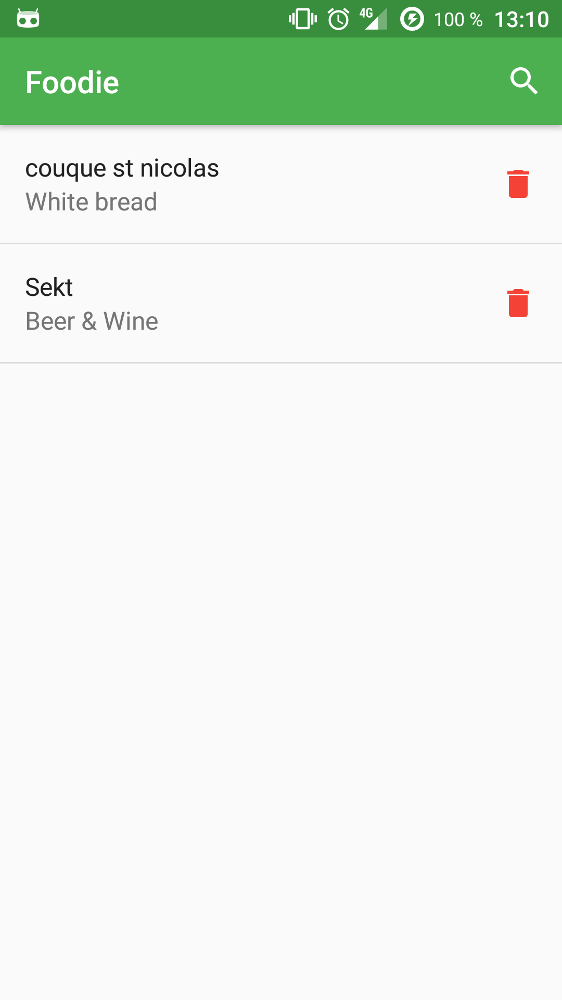
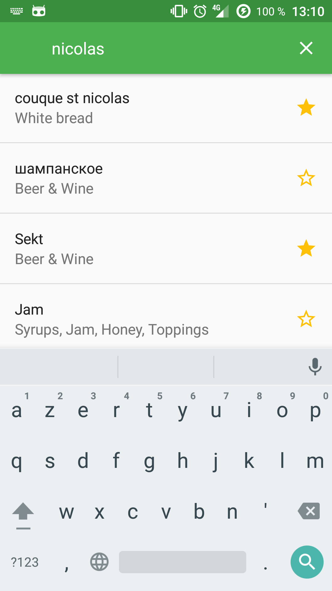
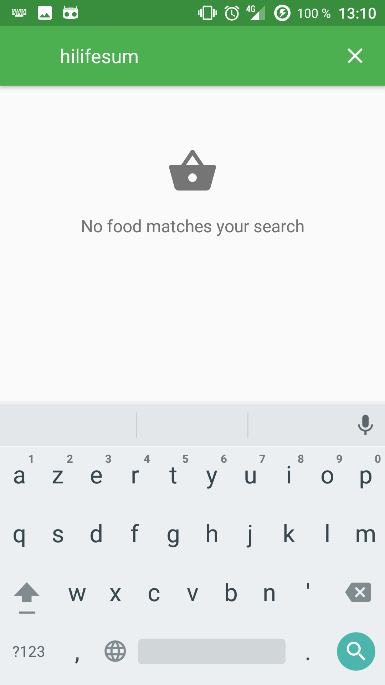

## Foodie ##

The app is developed with android studio. The minimum api is API 19, Android 4.4 KitKat.

It is a sample app that displays a list of locally saved food. You can hit the search button to search trough a given API a list of food. With the searched list you can save / remove the food locally.

## Libraries ##

 - The support library for design and RecyclerView.
 - Dagger 2 for dependencies injections.
 - Retrofit coupled with Gson for network purposes.
 - RxJava (1.x) & RxAndroid & RxBindings for reactive programming, easy threading.
 - Realm (2.x) & Realm Adapters for storing and displaying data locally.
 - ConstraintLayout for some views.
 - TapTargetView for the material design discovery feature.
 - JUnit & PowerMockito for unit testing

## Icon ##

The icon of the app is taken from [Logdust](http://logodust.com/?giveaway) and resized with [Android Asset Studio](https://romannurik.github.io/AndroidAssetStudio/icons-launcher.html).